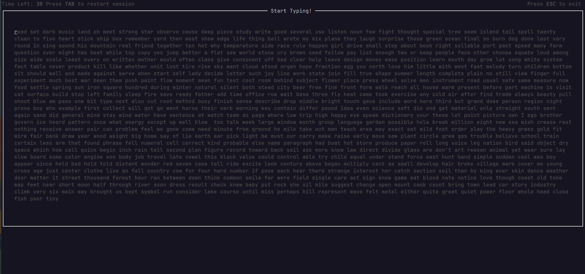
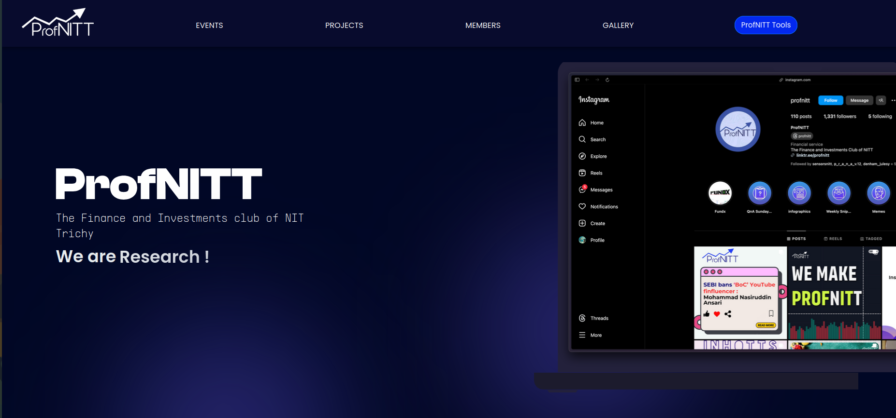

# POW

[Aditya](https://adityaps.work) This Side. open source `rust` programmer, `Full Stack Developer`  and `UI/UX`engineer, worked in Multiple Startups!

**[GitHub](https://github.com/Aditya-PS-05) | [Figma](https://www.notion.so/POW-2861e9d33abd80588760fac2a22af86b?pvs=21)**

# Work Experience :)

[Journim](https://www.notion.so/POW-2861e9d33abd80588760fac2a22af86b?pvs=21): Front-end web development in `Next.js` and `Typescript`. Turning `figma` design into reality | [Link](https://www.notion.so/POW-2861e9d33abd80588760fac2a22af86b?pvs=21)

[HAQQ-Studios](https://github.com/HAQQ-Studios): Working as remote `full stack` developer and building their product [Runitup.ai](http://Runitup.ai) and solving one `github issue` at a time. 

# Projects :)

Jotion | [Link](https://github.com/Aditya-PS-05/Jotion)

A webapp to `create`, `publish` `posts` similar to `Notion`.

[https://github.com/Aditya-PS-05/Jotion](https://github.com/Aditya-PS-05/Jotion)

### TypRs

`typrs` is a touch typing app to work on your typing skills right from the comfort of your terminal. 

[https://github.com/Aditya-PS-05/typrs](https://github.com/Aditya-PS-05/typrs)

### **Blyte | [Link](https://www.figma.com/design/wG3Ut1vWOteHQdqsLMnH7W/Blyte?node-id=0-1&t=Upi04rnEgPoiD4j6-1)**

a `figma` design for an app, for a device named Blyte which measures the `hydration` of the whole body. 

### **ProfNITT | [Link](https://profnitt.vercel.app/)**

An investment and finance club website.

[https://github.com/Aditya-PS-05/Profnitt](https://github.com/Aditya-PS-05/Profnitt)

### Glore Web | [Link](https://glore-web.vercel.app/)

A website for an app, which connects `players` from `various games`. 

[https://www.figma.com/design/tc0Tc5M1lo8I577hJM8CVM/Glore.App?node-id=0-1&t=5uQHuZuadpiJuZva-1](https://www.figma.com/design/tc0Tc5M1lo8I577hJM8CVM/Glore.App?node-id=0-1&t=5uQHuZuadpiJuZva-1)

### Mortgage App | [Link](https://www.figma.com/design/GgNZViOBsXR2A0UFK4TUru/Mortage-App?node-id=0-1&t=IL6KtSev58ZFp3yj-1)

An app which I built for my US based client. This app when launched will enable users to `buy Mortgages` in the US.

[https://github.com/Aditya-PS-05/mortage-app](https://github.com/Aditya-PS-05/mortage-app)

[https://www.figma.com/design/GgNZViOBsXR2A0UFK4TUru/Mortage-App?node-id=0-1&t=IL6KtSev58ZFp3yj-1](https://www.figma.com/design/GgNZViOBsXR2A0UFK4TUru/Mortage-App?node-id=0-1&t=IL6KtSev58ZFp3yj-1)

# Open Source Work : )

I contribute regularly on orgs like `Astral-sh` and `Rust-lang` specially in `rust` language to master it. . 

## Astral-sh/uv

[https://github.com/astral-sh/uv/pull/8226](https://github.com/astral-sh/uv/pull/8226)

[https://github.com/astral-sh/uv/pull/8215](https://github.com/astral-sh/uv/pull/8215)

[https://github.com/astral-sh/uv/pull/8179](https://github.com/astral-sh/uv/pull/8179)

[https://github.com/astral-sh/uv/pull/7330](https://github.com/astral-sh/uv/pull/7330)

[https://github.com/astral-sh/uv/pull/7387](https://github.com/astral-sh/uv/pull/7387)

[https://github.com/astral-sh/uv/pull/7937](https://github.com/astral-sh/uv/pull/7937)

[Rust-Lang/Rust](https://github.com/rust-lang/rust)

[https://github.com/rust-lang/rust/pull/135406](https://github.com/rust-lang/rust/pull/135406)