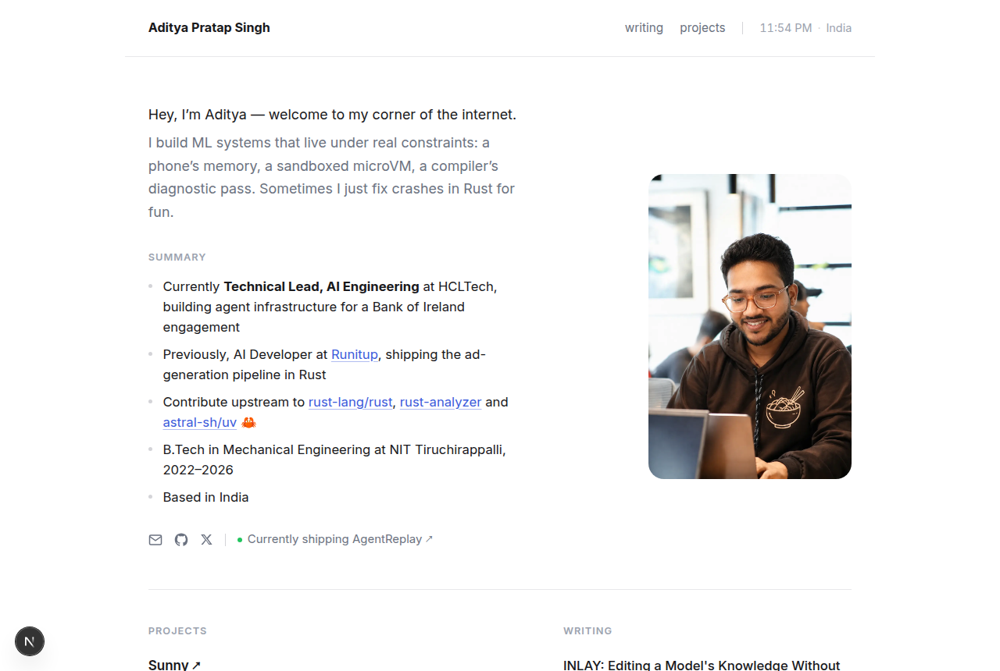
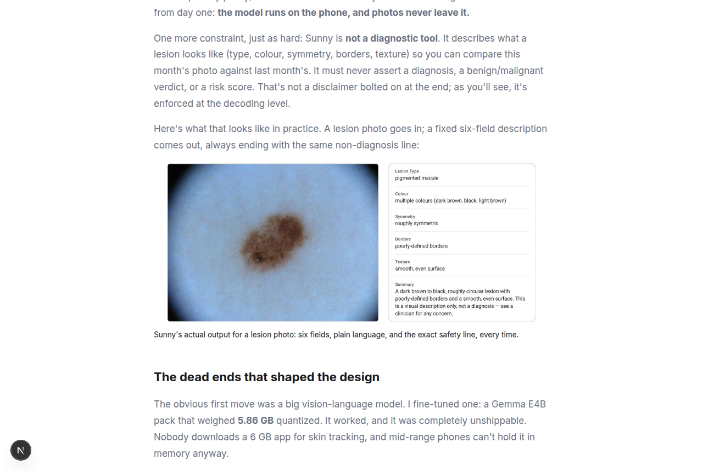

<!-- <CENTERED SECTION FOR GITHUB DISPLAY> -->

<div align="center">

[](https://adityaps.work)

# adityaps.work

**Personal site of Aditya Pratap Singh — ML systems engineer.**
<br/>
Minimal, fast, fully static. A live status bar, MDX writing with real figures, and zero backend.

[](https://nextjs.org)
[](https://react.dev)
[](https://tailwindcss.com)
[](https://vercel.com)
[](#license)

[**Visit the site →**](https://adityaps.work)

</div>

---

## What this is

My corner of the internet: who I am, what I've shipped, and long-form writing about the work — like fine-tuning a 500M-parameter vision model to run [fully offline on a phone](https://adityaps.work/posts/sunny-on-device-skin-tracking), or building a [gradient-free knowledge-editing method](https://adityaps.work/posts/inlay-knowledge-editing) and benchmarking it honestly against the field.

<div align="center">

|              Home              |              Writing               |
| :----------------------------: | :--------------------------------: |
|  |  |

</div>

## Design principles

- **Fully static.** Every route is prerendered at build time. No database, no auth, no API routes, no environment variables. Six runtime dependencies total.
- **Content is just files.** Posts are MDX files in `src/content/posts/` with frontmatter. Add a file, push, done. GitHub-flavored tables and images work out of the box (`remark-gfm`).
- **Small, honest touches.** The top bar shows my actual local time and live weather (client-side, [Open-Meteo](https://open-meteo.com), no key needed). Post figures are generated from real experiment data, not decoration.
- **One accent color, one font.** Inter, a blue, and whitespace. The content does the talking.

## Stack

| Layer     | Choice                                            |
| --------- | ------------------------------------------------- |
| Framework | Next.js 16 (App Router, static export per route)  |
| UI        | React 19, plain CSS with design tokens            |
| Content   | MDX via `next-mdx-remote` + `gray-matter`         |
| Fonts     | Inter via `next/font`                             |
| Hosting   | Vercel                                            |

## Run it locally

```bash
git clone https://github.com/Aditya-PS-05/portfolio
cd portfolio
pnpm install
pnpm dev
```

Open [http://localhost:3000](http://localhost:3000). That's it — no `.env`, nothing to provision.

## Writing a post

Drop an MDX file into `src/content/posts/`:

```mdx
---
title: "Your title"
date: "2026-08-17"
description: "One sentence for lists and previews."
tags: ["tag"]
private: false
---

Your words. Tables, images, and code blocks all work.
```

It appears on the homepage and `/archive` automatically. Files with `private: true` never build.

## Structure

```
src/
├── app/
│   ├── page.tsx            # home: bio, projects, writing
│   ├── archive/            # all posts, grouped by year
│   ├── posts/[slug]/       # MDX post pages
│   ├── globals.css         # design tokens + all styling
│   └── icon.svg            # favicon
├── components/
│   ├── Header.tsx          # top bar
│   └── LiveStatus.tsx      # live clock + weather
├── content/posts/          # the writing (MDX)
└── lib/content.ts          # frontmatter loader
```

## License

MIT — take whatever is useful. The writing and images are mine; please don't republish those as your own.

<div align="center">

Built by [Aditya Pratap Singh](https://adityaps.work) · [adipras1407@gmail.com](mailto:adipras1407@gmail.com)

</div>
